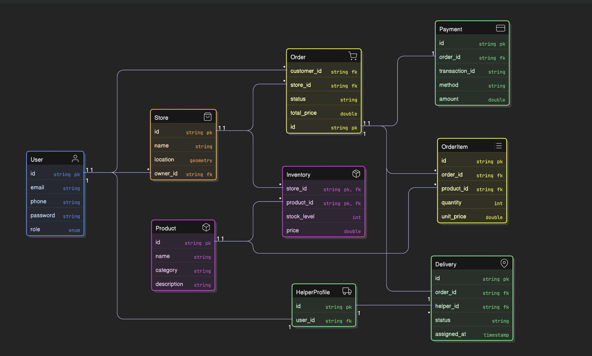
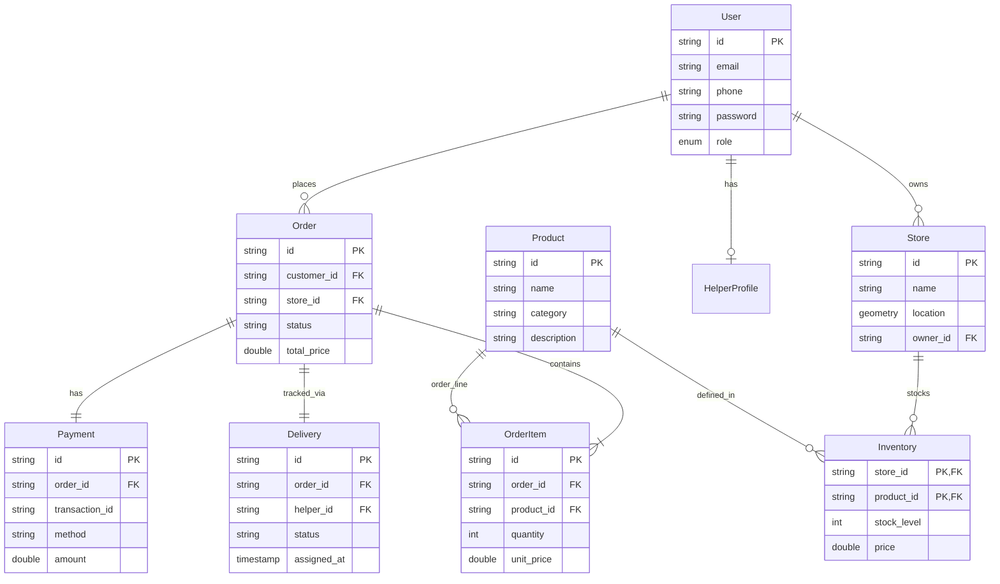

# Entity Relationship Diagram (ERD)

## Visual Diagram

Designed for a relational structure using TypeScript models (Prisma/TypeORM).

## Mermaid Diagram

```mermaid
erDiagram
    User ||--o{ Order : places
    User ||--o{ Store : owns
    User ||--o| HelperProfile : has

    Store ||--o{ Inventory : stocks
    Product ||--o{ Inventory : defined_in
    
    Order ||--|{ OrderItem : contains
    Product ||--o{ OrderItem : order_line
    
    Order ||--|| Payment : has
    Order ||--|| Delivery : tracked_via

    User {
        string id PK
        string email
        string phone
        string password
        enum role
    }

    Store {
        string id PK
        string name
        geometry location
        string owner_id FK
    }

    Product {
        string id PK
        string name
        string category
        string description
    }

    Inventory {
        string store_id PK, FK
        string product_id PK, FK
        int stock_level
        double price
    }

    Order {
        string id PK
        string customer_id FK
        string store_id FK
        string status
        double total_price
    }

    OrderItem {
        string id PK
        string order_id FK
        string product_id FK
        int quantity
        double unit_price
    }

    Payment {
        string id PK
        string order_id FK
        string transaction_id
        string method
        double amount
    }

    Delivery {
        string id PK
        string order_id FK
        string helper_id FK
        string status
        timestamp assigned_at
    }
```
