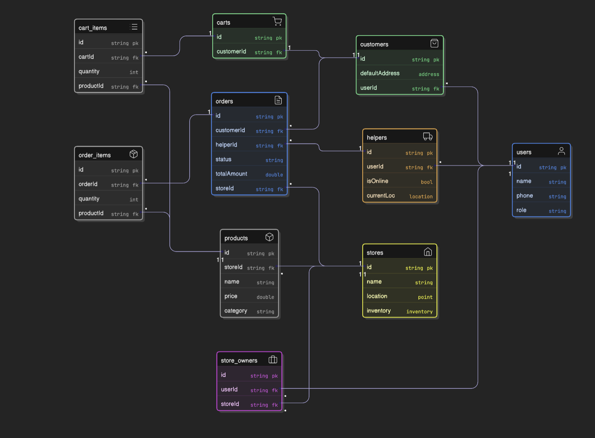
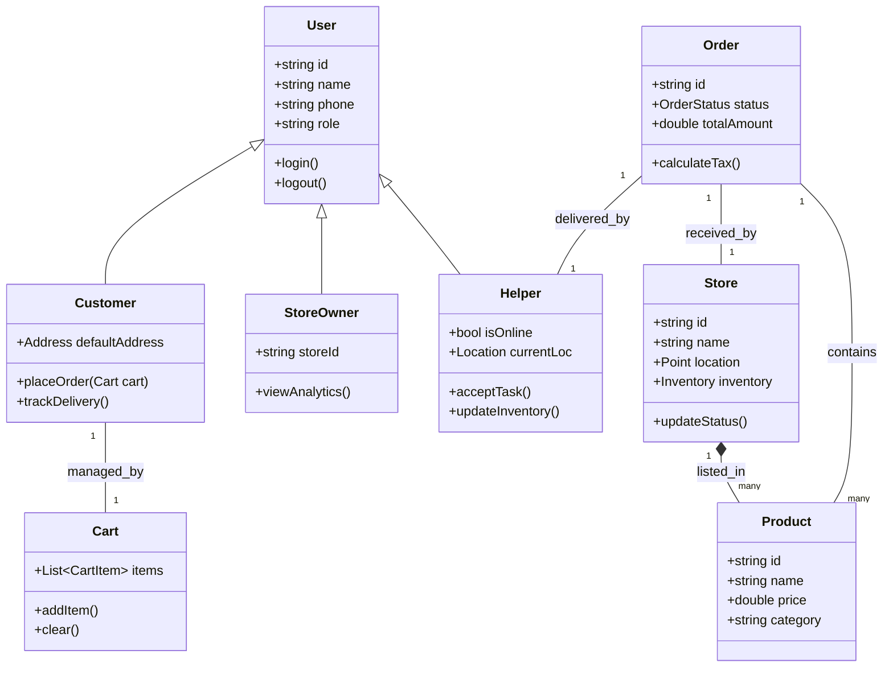

# Class Diagram

## Visual Diagram

This diagram represents the object-oriented structure of the TypeScript backend, showing clear inheritance and system entities.

## Mermaid Diagram

```mermaid
classDiagram
    class User {
        +string id
        +string name
        +string phone
        +string role
        +login()
        +logout()
    }

    class Customer {
        +Address defaultAddress
        +placeOrder(Cart cart)
        +trackDelivery()
    }

    class StoreOwner {
        +string storeId
        +viewAnalytics()
    }

    class Helper {
        +bool isOnline
        +Location currentLoc
        +acceptTask()
        +updateInventory()
    }

    class Store {
        +string id
        +string name
        +Point location
        +Inventory inventory
        +updateStatus()
    }

    class Product {
        +string id
        +string name
        +double price
        +string category
    }

    class Order {
        +string id
        +OrderStatus status
        +double totalAmount
        +calculateTax()
    }

    class Cart {
        +List~CartItem~ items
        +addItem()
        +clear()
    }

    User <|-- Customer
    User <|-- StoreOwner
    User <|-- Helper

    Customer "1" -- "1" Cart : managed_by
    Store "1" *-- "many" Product : listed_in
    Order "1" -- "1" Store : received_by
    Order "1" -- "1" Helper : delivered_by
    Order "1" -- "many" Product : contains
```
