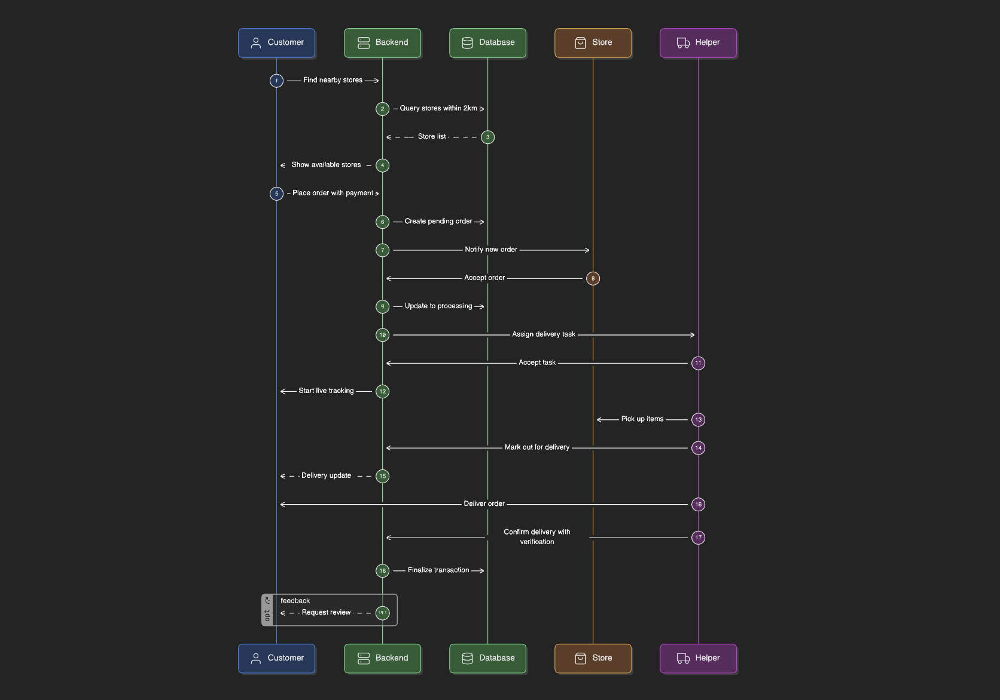
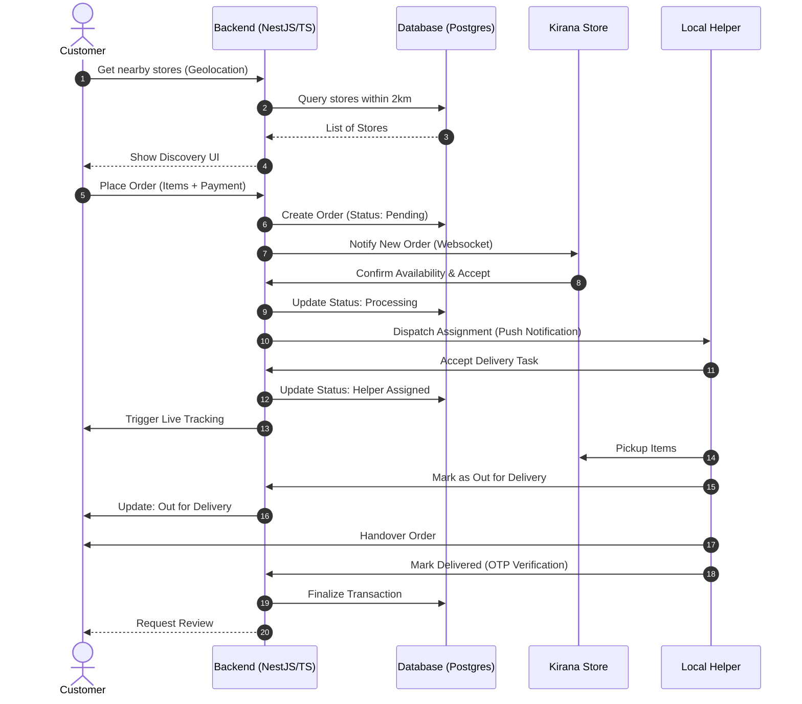

# Sequence Diagram: Main Order Flow

## Visual Diagram

This diagram tracks the end-to-end journey of a single order, from customer discovery to helper delivery.

## Mermaid Diagram

```mermaid
sequenceDiagram
    autonumber
    actor Customer
    participant API as Backend (NestJS/TS)
    participant DB as Database (Postgres)
    participant Store as Kirana Store
    participant Helper as Local Helper

    Customer->>API: Get nearby stores (Geolocation)
    API->>DB: Query stores within 2km
    DB-->>API: List of Stores
    API-->>Customer: Show Discovery UI

    Customer->>API: Place Order (Items + Payment)
    API->>DB: Create Order (Status: Pending)
    API->>Store: Notify New Order (Websocket)

    Store->>API: Confirm Availability & Accept
    API->>DB: Update Status: Processing

    API->>Helper: Dispatch Assignment (Push Notification)
    Helper->>API: Accept Delivery Task
    API->>DB: Update Status: Helper Assigned
    API->>Customer: Trigger Live Tracking

    Helper->>Store: Pickup Items
    Helper->>API: Mark as Out for Delivery
    API->>Customer: Update: Out for Delivery

    Helper->>Customer: Handover Order
    Helper->>API: Mark Delivered (OTP Verification)
    API->>DB: Finalize Transaction
    API-->>Customer: Request Review
```
