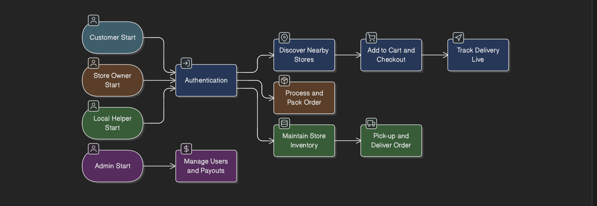

# Use Case Diagram

## Visual Diagram


## Actors
*   **Customer:** Browses, orders, and tracks items.
*   **Store Owner:** Manages business profile and views sales.
*   **Local Helper:** Updates inventory and delivers orders.
*   **Admin:** Orchestrates the platform and handles disputes.

## Mermaid Diagram
```mermaid
useCaseDiagram
    actor "Customer" as C
    actor "Store Owner" as S
    actor "Local Helper" as H
    actor "Admin" as A

    package "Hyperlocal Platform" {
        usecase "Authenticate (Login/Register)" as UC1
        usecase "Discover Nearby Stores" as UC2
        usecase "Add to Cart & Checkout" as UC3
        usecase "Track Delivery Live" as UC4
        usecase "Maintain Store Inventory" as UC5
        usecase "Process & Pack Order" as UC6
        usecase "Pick-up & Deliver Order" as UC7
        usecase "Manage Users & Payouts" as UC8
    }

    C --> UC1
    C --> UC2
    C --> UC3
    C --> UC4

    S --> UC1
    S --> UC6

    H --> UC1
    H --> UC5
    H --> UC7

    A --> UC8
```
